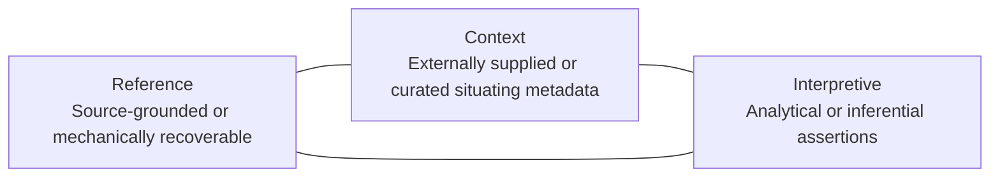
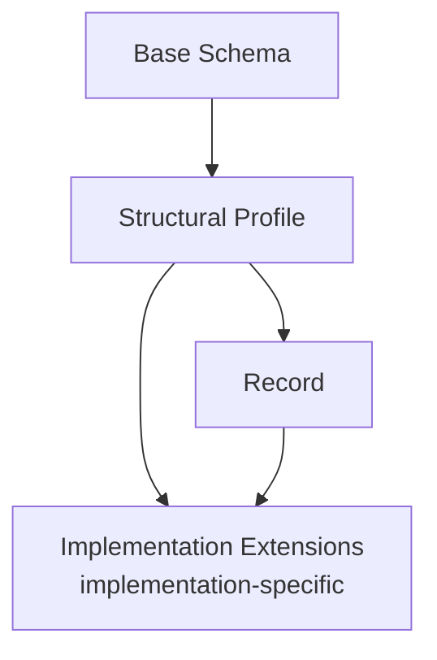

# MetaRCI

MetaRCI is a domain-agnostic metadata model for retrieval and knowledge systems.

Its core thesis is that metadata should be separated by epistemic role, because how a metadata claim is established determines how that claim can be governed, trusted, and safely used.

MetaRCI organizes metadata into three tiers:

- Reference
- Context
- Interpretive

The model is intentionally architectural. It is designed to help teams reason explicitly about metadata provenance and function before metadata is operationalized in retrieval, governance, or analytical pipelines.

## The Metadata-Flattening Problem

Many retrieval-oriented systems start from an understandable baseline: ingest sources, extract text, chunk, embed, index, retrieve. That baseline can produce useful systems, but it often treats metadata as a flat layer of fields, parser output, or ad hoc enrichment.

This creates a recurring failure mode: materially different claims are collapsed into one undifferentiated metadata surface.

- Source-grounded facts derived from artifacts.
- Externally established or curated context.
- Interpretive or analytical assertions.

When these are collapsed, provenance can blur, confidence can be overstated, governance boundaries can become hard to audit, and retrieval behavior can become harder to justify or tune.

There is an opposite failure mode as well: teams may assume meaningful semantic structure requires a complete ontology, mature taxonomy program, or graph infrastructure before implementation can begin.

MetaRCI is a practical middle path between those extremes.

## The MetaRCI Proposition: Proportionate Semantic Modeling

MetaRCI treats metadata design as proportional to the corpus, use case, risk profile, governance needs, and downstream decisions the system must support.

The model does not prescribe maximal metadata and does not treat semantic richness as an all-or-nothing prerequisite.

A field should not be included merely because it can be modeled.

This is a design discipline, not a promise of low cost. The question is not whether more metadata can be added, but whether specific metadata improves the system enough to justify extraction, curation, review, and maintenance.

## The Three-Tier Epistemic Model

MetaRCI separates metadata by epistemic basis.



The tiers are not a mandatory processing pipeline. They are distinct classes of claims.

### Reference

Reference captures metadata that can generally be established from the source artifact or ingestion process with minimal interpretation.

Reference should preserve source-grounded facts without silently promoting inference into source truth.

### Context

Context captures curated or externally supplied metadata that situates a source within organizational, bibliographic, geographic, jurisdictional, chronological, or operational frames.

Context should preserve the basis of externally established claims instead of blending them into source-grounded fact.

### Interpretive

Interpretive captures analytical, inferential, evaluative, or implementation-specific assertions about meaning, significance, relation, or use.

Interpretive should remain explicit and attributable, not implied as if it were mechanically established fact.

## How Tier Placement Is Decided

Tier placement is determined primarily by epistemic basis, not by property label, extraction tool, or whether a human or system populated the field.

- Mechanically or source-established claims belong in Reference.
- Externally established situating claims belong in Context.
- Analytical or inferential claims belong in Interpretive.

The same conceptual datum may therefore appear in different tiers depending on how it was established.

Example:

- A sensitivity phrase explicitly stated in the source remains a source-grounded claim.
- A curated classification determined by policy review is a contextual claim.

These two claims may be related, but they are not epistemically identical.

## Why Epistemic Separation Matters in Retrieval and Knowledge Systems

MetaRCI treats metadata as retrieval architecture rather than decorative annotation.

This separation can influence how systems handle:

- source identification and traceability;
- filtering and ranking behavior;
- provenance and auditability;
- query interpretation and answer qualification;
- lifecycle and governance decisions;
- abstention, uncertainty handling, and risk communication;
- downstream taxonomy, ontology, and graph-oriented analysis.

MetaRCI does not claim automatic quality gains. It provides a structure for making metadata-use decisions explicit and inspectable.

## Structural Profiles

MetaRCI profiles are structural specializations of a shared base model. They represent reusable source structures, not subject domains.



Current profile framing in this repository:

- document
- structured-data
- media
- composite (aggregation structures under further evaluation)

Implementation-specific requirements should remain outside the generic profile boundary where possible.

## Model-First Evaluation and Testbed Evidence

MetaRCI follows a model-first sequence:

Model -> Contract -> Structural Profile -> Record -> Testbed Evidence -> Revision

Testbeds are used to challenge and evaluate the model. They do not define the model by default from a single implementation context.

## Distinctive Contribution

MetaRCI is best understood as a synthesis and implementation architecture, not a claim to invent metadata layering.

Its distinctive contribution is a disciplined combination of:

- stable Reference/Context/Interpretive separation;
- classification by epistemic basis;
- domain-agnostic base with structural profiles;
- nullable and incremental adoption;
- explicit relevance to retrieval, provenance, and governance design;
- accessibility to both developers and subject-matter experts;
- a pathway toward richer taxonomy, ontology, or graph structures without requiring them at project inception.

Compact formulation:

Reference records. Context situates. Interpretation models.

Working definition:

MetaRCI is a domain-agnostic metadata model for retrieval and related knowledge systems that organizes metadata into Reference, Context, and Interpretive tiers according to how claims are established and used. It supports proportionate semantic modeling through executable contracts, structural profiles, nullable fields, and evidence-driven revision.

## Relationship to Established Standards and Practices

MetaRCI builds on established metadata and knowledge-organization traditions without attempting to replace them.

Its focus is different: epistemic role as an organizing principle for metadata architecture.

| Existing system or tradition | Relevant contribution | Relationship to MetaRCI | Primary difference |
| --- | --- | --- | --- |
| Dublin Core | Broad interoperable resource-description terms | MetaRCI fields may reuse or map to Dublin Core terms | Dublin Core is a vocabulary; MetaRCI organizes claims by epistemic role |
| METS | Packaging descriptive, administrative, and structural metadata | Demonstrates coordinated handling of multiple metadata kinds | METS is an encoding/packaging standard, not a progressive metadata-architecture method |
| W3C PROV | Provenance modeling for entities, activities, and agents | Supports provenance alignment for extraction, curation, and interpretation | PROV models provenance; MetaRCI additionally separates claim classes by epistemic tier |
| SKOS | Controlled concept schemes and semantic relations | Potential interoperability target for contextual/interpretive vocabularies | SKOS models vocabularies; MetaRCI governs broader source-record architecture |
| IFLA LRM | Bibliographic entities and relationships | Useful in bibliographic profile contexts | IFLA LRM is bibliographic in scope; MetaRCI is domain-agnostic and retrieval-oriented |
| Metadata application profiles | Reuse and local constraint patterns | Strong precedent for profile-based design | Application profiles do not inherently enforce R/C/I epistemic separation |
| Metadata-aware RAG research | Evidence for metadata-sensitive retrieval behavior | Motivates field-level metadata design discipline | Most studies evaluate retrieval techniques, not end-to-end metadata-development architecture |
| Graph-oriented retrieval | Relationship-aware retrieval and traversal models | Supports downstream pathway from interpretive relationships to graph use | MetaRCI does not require graph infrastructure |

## What MetaRCI Does Not Claim

MetaRCI is not:

- a RAG application;
- a retrieval engine;
- an ontology;
- a universal metadata standard;
- a parser or extraction framework;
- a requirement that every field be populated;
- a replacement for domain-specific standards;
- a claim that all metadata can be automatically derived.

Its claim is narrower: separating metadata claims by epistemic role creates a clearer scaffold for trustworthy retrieval and knowledge-system design.

## Nullability and Incompleteness

MetaRCI allows metadata to remain absent or null when values are unknown, unavailable, inapplicable, or not yet curated.

Completeness does not mean filling every field. The model is designed to preserve absence and uncertainty rather than incentivize fabricated metadata.

## Current Project Status

This repository currently provides:

- an implemented base schema and validator;
- active profile evaluation for document, structured-data, and media, including static and temporal media evidence;
- an executable composite profile scaffold that remains draft/deferred for further structural evaluation.

Project status remains draft/pre-release.

## Documentation and Further Reading

For detailed technical material, see:

- Tier notes and conceptual guidance: [documentation/tier-notes.md](documentation/tier-notes.md)
- Profile model and contract boundaries: [documentation/profile-model.md](documentation/profile-model.md)
- Profile-specific guidance: [documentation/profiles/](documentation/profiles)
- Validation behavior: [documentation/validation.md](documentation/validation.md)
- Extension model: [documentation/extensions.md](documentation/extensions.md)
- Testbed methodology: [documentation/testbeds.md](documentation/testbeds.md)
- Testbed reports: [documentation/testbed-reports/README.md](documentation/testbed-reports/README.md)
- Roadmap and deferred questions: [TODO.md](TODO.md)

## Selected Bibliography with Commentary

MetaRCI draws on established work in metadata design, application profiles, provenance, knowledge organization, semantic enrichment, and metadata-aware retrieval. These sources do not describe the MetaRCI model itself; they provide the standards, concepts, and empirical findings against which the model is positioned.

### Metadata Foundations

* Dublin Core Metadata Initiative. (2020). *DCMI Metadata Terms*. Dublin Core Metadata Initiative.
    https://www.dublincore.org/specifications/dublin-core/dcmi-terms/
    Provides a broadly applicable vocabulary for describing resources, including terms for title, creator, date, format, identifier, source, relation, subject, coverage, and rights. DCMI terms offer a likely interoperability target for selected MetaRCI fields.

* Riley, J. (2017). *Understanding Metadata: What Is Metadata, and What Is It For? A Primer*. National Information Standards Organization.
    https://www.niso.org/publications/understanding-metadata-2017
    A useful overview of metadata types, functions, standardization, and practical applications. It provides foundational terminology for distinguishing technical, descriptive, administrative, structural, and preservation-oriented metadata.

* Library of Congress. (2025). *Metadata Encoding and Transmission Standard: METS 2*.
    https://www.loc.gov/standards/mets/
    METS provides an established model for packaging descriptive, administrative, and structural metadata associated with digital objects. MetaRCI uses a different organizing principle, but METS is an important comparison for the separation and coordinated management of metadata types.

### Metadata Application Profiles

* Heery, R., & Patel, M. (2000). Application profiles: Mixing and matching metadata schemas. *Ariadne, 25*.
    https://www.ariadne.ac.uk/issue/25/app-profiles/
    Introduces application profiles as locally optimized metadata schemas composed from elements drawn from one or more namespaces. This is a major precedent for MetaRCI's use of a reusable core combined with corpus- and domain-specific YAML profiles.

* Dublin Core Metadata Initiative. (2009). *Dublin Core Application Profile Guidelines*.
    https://www.dublincore.org/specifications/dublin-core/application-profile-guidelines/
    Provides guidance for documenting how metadata terms are selected, constrained, encoded, and applied within a specific implementation. MetaRCI profiles can build on this tradition while adding the Reference-Context-Interpretive tier structure.

### Provenance and Attribution

* Lebo, T., Sahoo, S., McGuinness, D., Belhajjame, K., Cheney, J., Corsar, D., Garijo, D., Soiland-Reyes, S., Zednik, S., & Zhao, J. (2013). *PROV-O: The PROV Ontology*. World Wide Web Consortium.
    https://www.w3.org/TR/prov-o/
    Defines a domain-agnostic ontology for representing entities, activities, agents, derivation, attribution, and provenance. PROV-O provides an important foundation for distinguishing extracted, generated, curated, and interpreted MetaRCI values.

* World Wide Web Consortium. (2013). *Dublin Core to PROV Mapping*.
    https://www.w3.org/TR/prov-dc/
    Defines mappings between Dublin Core Terms and the W3C PROV model. This demonstrates how general resource description and provenance assertions can coexist without being treated as the same kind of metadata.

### Taxonomy and Knowledge Organization

* Miles, A., & Bechhofer, S. (Eds.). (2009). *SKOS Simple Knowledge Organization System Reference*. World Wide Web Consortium.
    https://www.w3.org/TR/skos-reference/
    Defines a model for expressing concept schemes, taxonomies, thesauri, classification systems, preferred labels, alternate labels, and semantic relationships. SKOS is a likely interoperability target for controlled vocabularies developed through MetaRCI Context and Interpretive profiles.

* Baker, T., Bechhofer, S., Isaac, A., Miles, A., Schreiber, G., & Summers, E. (2013). Key choices in the design of Simple Knowledge Organization System. *Web Semantics: Science, Services and Agents on the World Wide Web, 20*, 35-49.
    https://doi.org/10.1016/j.websem.2013.05.001
    Explains major SKOS design decisions, including its emphasis on supporting lightweight knowledge-organization systems without requiring maximal ontological commitment. This principle is particularly relevant to MetaRCI's incremental approach.

* Zeng, M. L., & Mayr, P. (2018). Knowledge organization systems in the Semantic Web: A multi-dimensional review. *International Journal on Digital Libraries, 20*, 209-230.
    https://doi.org/10.1007/s00799-018-0241-2
    Reviews the use of taxonomies, thesauri, authority systems, classifications, and lightweight ontologies in linked-data and Semantic Web environments. It provides broader context for MetaRCI's potential progression toward graph-ready knowledge organization.

### Bibliographic and Relational Modeling

* Riva, P., Le Boeuf, P., & Zumer, M. (2017). *IFLA Library Reference Model: A Conceptual Model for Bibliographic Information*. International Federation of Library Associations and Institutions.
    https://repository.ifla.org/handle/123456789/40
    Defines a high-level entity-relationship model for works, expressions, manifestations, items, agents, places, time spans, and related bibliographic relationships. Although bibliographic in scope, it is relevant to MetaRCI Context profiles dealing with alternate titles, editions, lineage, related works, and external authority structures.

### Metadata and Retrieval-Augmented Generation

* Yousuf, R. B., Xu, S., Sharma, M., Neeser, A., Latimer, C., & Ramakrishnan, N. (2026). *Utilizing Metadata for Better Retrieval-Augmented Generation*. arXiv preprint arXiv:2601.11863.
    https://arxiv.org/abs/2601.11863
    Compares several metadata-aware retrieval strategies, including metadata prefixes, unified metadata-content embeddings, late fusion, and metadata-aware query reformulation. The study reports that metadata can improve document cohesion and distinguish relevant chunks in repetitive corpora, while field-level ablation shows that metadata fields do not contribute equally. This directly supports MetaRCI's use-case-driven field-selection principle.

* Lin, C., Feng, B.-H., Chen, X., Yang, T.-L., Lee, H.-Y., & Jang, J.-S. R. (2025). A preliminary study of RAG for Taiwanese historical archives. In *Proceedings of the 37th Conference on Computational Linguistics and Speech Processing*, 45-62. Association for Computational Linguistics.
    https://aclanthology.org/2025.rocling-main.6/
    Examines metadata integration in RAG over historical archives. The study reports improvements in retrieval and answer accuracy from early-stage metadata integration while also documenting persistent temporal, multi-hop, and generation problems.

* Mishra, P. P., Yeole, K. P., Keshavamurthy, R., Surana, M. B., & Sarayloo, F. (2025). *A Systematic Framework for Enterprise Knowledge Retrieval: Leveraging LLM-Generated Metadata to Enhance RAG Systems*. arXiv preprint arXiv:2512.05411.
    https://arxiv.org/abs/2512.05411
    Evaluates metadata enrichment alongside multiple chunking and embedding strategies for enterprise retrieval. It is relevant as emerging evidence for metadata-enriched RAG, although its use of LLM-generated metadata differs from MetaRCI's emphasis on provenance distinctions and controlled human curation.

* Dadopoulos, G., & Ladas, C. (2025). *Metadata-Driven Retrieval-Augmented Generation for Financial Question Answering*. arXiv preprint arXiv:2510.24402.
    https://arxiv.org/abs/2510.24402
    Evaluates pre-retrieval metadata filtering, metadata-enriched chunk representations, and post-retrieval reranking over financial documents. It is useful for examining how metadata can be operationalized at different stages of a RAG pipeline and how lower-cost alternatives may be evaluated against more expensive reranking approaches.

### Knowledge Graphs and Graph-Oriented RAG

* Zhu, X., Xie, Y., Liu, Y., Li, Y., & Hu, W. (2025). Knowledge graph-guided retrieval augmented generation. In *Proceedings of NAACL 2025*, 8912-8924. Association for Computational Linguistics.
    https://doi.org/10.18653/v1/2025.naacl-long.449
    Presents KG²RAG, which uses relationships between retrieved chunks to expand and organize retrieval results. It supports MetaRCI's proposition that explicit relationships developed through the Interpretive Tier can provide a foundation for later graph-oriented retrieval.

* Pan, H., Zhang, Q., Adamu, M., Dragut, E., & Latecki, L. J. (2025). Taxonomy-driven knowledge graph construction for domain-specific scientific applications. In *Findings of the Association for Computational Linguistics: ACL 2025*, 4295-4320. Association for Computational Linguistics.
    https://doi.org/10.18653/v1/2025.findings-acl.223
    Describes a domain-specific knowledge-graph construction process grounded in an expert-curated taxonomy. The paper is relevant to MetaRCI's proposed pathway from controlled contextual and interpretive metadata toward graph-ready entities and relationships.

## Notes on Source Status

The W3C, DCMI, IFLA, NISO, and Library of Congress entries are standards, specifications, conceptual models, or professional guidance documents.

The ACL Anthology entries are published conference papers.

The arXiv entries are publicly available preprints and should be identified as such when their findings are discussed. Their inclusion provides awareness of emerging RAG research but should not be interpreted as equivalent to an established metadata standard or settled empirical consensus.

## Optional Helpers (Analyst-Friendly)

For analysts and documentation-heavy workflows, the following editor helpers can improve readability and YAML authoring clarity:

* Red Hat YAML extension for YAML validation and schema-aware editing support.
* Rainbow Indent extension for visual indentation guidance in nested YAML/Markdown structures.

These helpers are optional and not required by the MetaRCI contract or validator behavior.

## Future Enhancements

### Relational Structured Data

The current MetaRCI **Structured Data** profile has been evaluated primarily against flat or tabular source structures such as delimited files and spreadsheets. A future evaluation should determine whether the same profile can represent **relational data** without requiring relational sources to become a separate top-level structural profile.

The working hypothesis is that relational data belongs within Structured Data.

Both flat/tabular and relational sources organize information through explicitly structured fields and records. Relational sources, however, expose additional structural semantics that may not exist in a CSV, TSV, or ordinary spreadsheet:

* database and schema identity;
* table and view identity;
* declared column types;
* column nullability;
* primary keys;
* foreign keys;
* uniqueness constraints;
* other declared constraints;
* relationships among tables;
* and potentially the distinction between stored tables, views, and query results.

These properties create additional metadata pressure, but they do not necessarily represent a different fundamental source structure. The purpose of future testing is therefore to determine whether they can be modeled as a **relational specialization of Structured Data** while preserving the common MetaRCI tier architecture.

### Architectural Question

The principal question is not:

> Should MetaRCI create a SQL profile?

Instead, it is:

> Does relational structure introduce reusable structural requirements that belong within the existing Structured Data profile, and if so, how should those requirements be represented without making flat/tabular sources unnecessarily complex?

A likely conceptual distinction is:

```text
Structured Data
├── Flat / Tabular
│   ├── CSV
│   ├── TSV
│   └── Spreadsheet
│
└── Relational
    ├── Tables
    ├── Views
    └── Query Results
```

This is a proposed structural distinction only. It does not yet imply profile inheritance, subprofiles, new YAML contracts, or validator behavior.

### Epistemic Considerations

Relational testing should continue to apply the same Reference / Context / Interpretive distinction used elsewhere in MetaRCI.

For example, database-native schema declarations such as a column type, primary-key declaration, foreign-key constraint, or nullable flag may qualify as **Reference** metadata when they can be recovered directly from the database schema.

External descriptions of what a table represents, business definitions for columns, data-steward assignments, organizational ownership, or controlled subject classifications may instead belong in **Context**.

Analytical conclusions about functional meaning, inferred entities, semantic equivalence among fields, inferred relationships not declared by the database, or mappings into a domain knowledge model may belong in **Interpretive**.

This distinction is particularly important for relational data because a database schema can describe structural relationships without necessarily establishing their complete business or semantic meaning.

### Candidate Testbeds

Future evaluation should use more than one relational source so that a single database design does not define the MetaRCI contract.

**Candidate 1: MySQL Sakila**

The MySQL Sakila sample database is a strong initial testbed because it provides an explicitly documented relational schema containing tables, views, stored procedures, functions, triggers, keys, and other database-native structures.

Sakila could be used to test:

* database/schema identity;
* tables and columns;
* declared data types;
* nullability;
* primary and foreign keys;
* table relationships;
* views;
* constraints;
* and the boundary between database-native structure and externally supplied semantic context.

Its breadth makes it useful for discovering relational metadata pressure without beginning with an enterprise-scale database.

**Candidate 2: Microsoft AdventureWorksLT**

AdventureWorksLT provides a second relational testbed from a different database ecosystem and with a different schema design.

It could test whether candidate relational fields derived from Sakila remain reusable across implementations rather than reflecting MySQL-specific behavior.

A second testbed should be used primarily as a **portability challenge**: fields promoted into the Structured Data contract should survive materially different relational examples without requiring vendor-specific assumptions.

### Proposed Evaluation Sequence

Relational evaluation should remain evidence-driven:

1. Preserve the current Structured Data contract as the baseline.
2. Inspect a bounded relational specimen without adding fields in advance.
3. Record structural information that the current profile cannot represent cleanly.
4. Classify each candidate datum by MetaRCI tier.
5. Distinguish genuinely relational structure from vendor-specific database features.
6. Test recurring candidate fields against a second relational source.
7. Promote only reusable structural requirements into the profile.
8. Defer database-engine-specific or deeply technical properties unless retrieval, governance, interoperability, or provenance requirements justify them.

The objective is not to model the complete semantics of SQL or database management systems.

It is to determine the **minimum relational structure MetaRCI needs to preserve source identity, structural provenance, relationships, and downstream usability without abandoning the domain-agnostic Structured Data profile**.

---

### Composite Sources

The current MetaRCI profile architecture treats **Document**, **Structured Data**, and **Media** as structural descriptions of source material. A future evaluation should reconsider whether **Composite** belongs as a peer structural profile or instead represents a **composition mechanism** for logical sources whose meaningful internal components span multiple structural types.

The working definition is:

> **Composite represents the whole/part structure of a logical source whose independently meaningful components may use different MetaRCI structural profiles while remaining components of a single coherent parent source.**

Under this definition, Composite does not describe another information structure in the same sense as Document, Structured Data, or Media. It describes how multiple information structures participate in one source.

A presentation provides a useful example. A PowerPoint file may contain slide text, speaker notes, images, video, tables, charts, and chart data. Those components do not necessarily share one structural model:

* slide text and notes may be Document-like;
* images, audio, and video may use Media;
* tables and chart data may use Structured Data;
* the presentation as a whole must preserve parent identity, component membership, ordering, containment, and relationships among those parts.

This creates composition pressure that differs from the structural concerns addressed by the existing profiles.

### Architectural Question

The principal question is not:

> Should MetaRCI create a PowerPoint or compound-file profile?

Instead, it is:

> Does MetaRCI need a reusable composition mechanism for representing a logical source whose meaningful components use different structural profiles?

A possible conceptual distinction is:

```text
Source Structure
├── Document
├── Structured Data
└── Media

Composition
└── Parent source
    ├── Component → Document
    ├── Component → Media
    └── Component → Structured Data
```

This is a proposed architectural distinction only. It does not yet imply a new schema, composition layer, manifest structure, profile inheritance model, or validator behavior.

### Composition Versus Packaging

Physical packaging alone should not make a source Composite.

Formats such as PPTX, DOCX, XLSX, ODP, and EPUB may internally contain multiple files or resources. A ZIP archive may contain many unrelated files. Those implementation details do not necessarily establish meaningful composition at the MetaRCI level.

The relevant question is whether the logical source contains **independently meaningful components whose identity or structure should be preserved for retrieval, provenance, governance, or interpretation**.

For example, an internal presentation theme or package relationship file may not warrant an independent MetaRCI record, while an embedded video, speaker-note sequence, or chart dataset may.

Future evaluation should therefore determine when a component becomes meaningful enough to model independently rather than reproducing the internal packaging structure of a file format.

### Epistemic Considerations

Composition should preserve the same Reference / Context / Interpretive architecture used elsewhere in MetaRCI.

A parent source may have its own R/C/I metadata, while independently modeled components may also have their own metadata records.

For example:

* package structure, component identifiers, ordering, and mechanically recoverable relationships may qualify as **Reference**;
* externally supplied descriptions of component roles, publication context, ownership, or intended use may belong in **Context**;
* inferred relationships, analytical roles, semantic connections among components, or judgments about component significance may belong in **Interpretive**.

Composition therefore introduces an additional question of **metadata scope**: whether a claim belongs to the parent source, an individual component, or a relationship among components.

Possible inheritance of parent metadata by components should remain an open question rather than an assumed behavior.

### Candidate Testbeds

Future evaluation should use more than one compound source format so that the internal architecture of a single packaging standard does not define the MetaRCI composition model.

**Candidate 1: PowerPoint Presentation (`.pptx`)**

PPTX is a strong initial testbed because one logical presentation can combine ordered slides, text, notes, images, audiovisual media, tables, charts, chart data, and embedded objects.

It could be used to test:

* parent and component identity;
* ordered membership;
* containment;
* heterogeneous component structures;
* component roles;
* parent-level versus component-level metadata;
* and relationships among components.

The initial specimen should be deliberately bounded but contain enough heterogeneous material to exercise Document, Media, and Structured Data within the same parent source.

**Candidate 2: OpenDocument Presentation (`.odp`)**

ODP provides a useful portability test for the presentation case.

It represents a similar logical source using a different document and packaging ecosystem. Testing ODP after PPTX could determine whether candidate composition semantics describe presentations generally rather than reflecting Office Open XML implementation details.

**Candidate 3: EPUB (`.epub`)**

EPUB provides a materially different composition challenge.

An EPUB publication can contain multiple content documents, images and other media, publication-level metadata, resource membership, and explicit reading order.

It could test whether composition concepts such as parent identity, membership, ordering, component role, and metadata scope remain reusable outside presentation formats.

### Boundary Cases

Other packaged formats may later provide useful boundary tests.

DOCX can contain images, charts, tables, and embedded objects while still functioning primarily as a Document source. XLSX can contain worksheets, charts, media, and embedded objects while remaining primarily Structured Data-like. ZIP files can contain arbitrary collections without representing one coherent logical source.

These cases may help determine when heterogeneous internal structure actually requires composition rather than merely existing inside a package.

They should not be used to define Composite simply because their file formats contain multiple internal resources.

### Proposed Evaluation Sequence

Composite evaluation should remain evidence-driven:

1. Treat the current Composite profile as draft scaffolding rather than a settled peer profile.
2. Preserve the current Document, Structured Data, and Media contracts as the baseline.
3. Inspect a bounded PPTX specimen without defining composition fields in advance.
4. Identify components that are independently meaningful at the MetaRCI level.
5. Determine whether existing structural profiles can describe those components.
6. Record parent/component, ordering, containment, role, and relationship requirements that the current model cannot represent cleanly.
7. Test recurring requirements against an ODP specimen.
8. Challenge the resulting concepts with a structurally different compound source such as EPUB.
9. Promote only recurring, format-independent composition semantics.
10. Decide from that evidence whether Composite should remain a structural profile, become a separate composition mechanism, or be represented through another part of the MetaRCI architecture.

The objective is not to reproduce the complete internal structure of compound file formats.

It is to determine the **minimum composition semantics MetaRCI needs to preserve heterogeneous source components as parts of a coherent parent source without collapsing those components into one structural type or confusing logical composition with physical packaging**.


