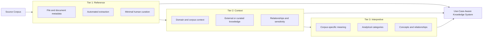
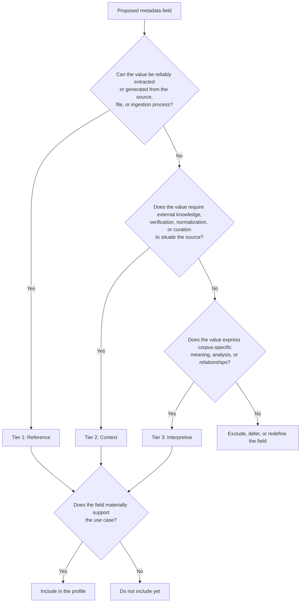
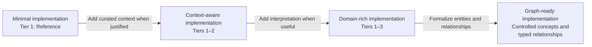

# MetaRCI 🔱

## A Progressive Metadata Model for Schema-Conscious RAG

### Proposal Status

MetaRCI is a proposed metadata model and implementation framework for organizing corpus metadata into three progressive tiers:

1. **Reference**
2. **Context**
3. **Interpretive**

MetaRCI is a standalone, domain-agnostic metadata model designed for use in Retrieval-Augmented Generation pipelines and related knowledge systems. It may be implemented as an optional feature in any compatible RAG framework, ingestion pipeline, knowledge management system, or corpus development workflow.



MetaRCI progressively organizes metadata according to how it is obtained and how it supports the use case. Implementations may adopt one, two, or all three tiers.
    
SCARAG [https://github.com/ttransou/SCARAG] serves as one reference implementation of MetaRCI rather than the framework for which MetaRCI was exclusively designed. Within SCARAG, MetaRCI can provide a structured approach to defining Reference, Context, and Interpretive metadata. Other systems may adopt the same model independently, adapting its YAML schemas and domain profiles to their own corpus, use case, and architecture.


---

# 1. Problem Statement

Many RAG implementations begin with a simple sequence:

1. collect documents;
2. extract text;
3. divide the text into chunks;
4. generate embeddings;
5. store the chunks in a vector index;
6. retrieve semantically similar passages.

This sequence can produce a working prototype, but it does not necessarily produce a trustworthy or maintainable knowledge system.

A document corpus contains more than text. Its sources have identities, dates, relationships, classifications, authority, sensitivity, intended uses, and domain-specific meanings. Some of that information can be extracted directly. Some must be supplied or verified by subject-matter experts. Some emerges only when the corpus is interpreted through the requirements of a particular use case.

When these distinctions are ignored, several kinds of metadata may be flattened into one collection of fields—or omitted altogether. Extracted values may be treated as equivalent to curated values. Inferred classifications may be presented as source facts. Important relationships may never be represented because they are not visible in the document text.

At the opposite extreme, teams may assume that reliable RAG requires a complete enterprise ontology, a mature taxonomy program, or an expensive knowledge graph before implementation can begin.

MetaRCI proposes a middle path:

> Begin with metadata that can be recovered reliably, add context that the use case requires, and introduce interpretation only where it produces practical value.

---

# 2. Purpose

MetaRCI provides implementers and subject-matter experts with a structured method for deciding:

* which metadata is necessary;
* how each value is obtained;
* which values require curation;
* which metadata should influence retrieval;
* which metadata supports governance or access decisions;
* which concepts and relationships may later support taxonomy, ontology, or graph development;
* and which fields are unnecessary for the current use case.

MetaRCI does not prescribe maximal metadata.

Its governing principle is:

> **Metadata should be designed in proportion to the corpus, use case, risk, and decisions the system must support.**

A small, narrowly scoped RAG system may require only a modest Reference Tier and selected Context fields. A regulated or analytically complex corpus may require all three tiers.


A field should not be included merely because it can be modeled.
---

# 3. Why MetaRCI Is Relevant to RAG

Recent research supports treating metadata as part of retrieval architecture rather than as peripheral document decoration.

Yousuf et al. (2026) compared several metadata-aware retrieval strategies and found that metadata integration could improve cohesion among chunks from the same document, reduce confusion among similar documents, and increase separation between relevant and irrelevant passages. Their field-level analysis also showed that different metadata fields contributed differently, reinforcing the need to select metadata according to corpus and retrieval requirements rather than treating all fields as equally useful.

Lin et al. (2025), working with Taiwanese historical archives, similarly reported that early-stage metadata integration improved retrieval and answer accuracy. They also found that metadata did not eliminate persistent difficulties involving hallucination, temporal questions, and multi-hop historical queries.

Dadopoulos et al. (2025) investigated metadata filtering, metadata-enriched chunks, enriched embeddings, and metadata-based reranking for financial question answering. Their custom metadata reranker was presented as a cost-effective alternative to commercial reranking systems, although the findings remain domain-specific and should not be read as evidence for one universally optimal RAG architecture.

These findings support the central MetaRCI position:

> Metadata can improve RAG, but its value depends on how it is selected, represented, maintained, and incorporated into retrieval.

MetaRCI is not itself a retrieval algorithm. It is a corpus-development model that makes those metadata decisions visible before a team commits to a particular vector database, embedding model, reranker, graph store, or orchestration framework.

---

# 4. The MetaRCI Model

## 4.1 Tier 1: Reference

The **Reference Tier** contains strict source metadata that can be automatically extracted or generated from the document, file, or ingestion process, with minimal human curation.

It establishes a machine-readable record of the source as received.

Typical Reference metadata may include:

* source identifier;
* original filename;
* source path or URI;
* file format;
* MIME type;
* checksum;
* file size;
* page count;
* row or column count;
* embedded title;
* stated author;
* stated version;
* creation date;
* modification date;
* effective or review dates extracted from consistent boilerplate;
* ingestion timestamp;
* parser name and version;
* extraction status;
* extraction diagnostics.

Tier 1 uses a broad, nullable schema. Not every field is relevant or available for every source.

A value may remain `null` when:

* the source does not contain it;
* the field does not apply;
* the file format does not expose it;
* extraction was not configured;
* or the value cannot be recovered reliably.

Tier 1 permits deterministic normalization, such as standardizing dates or language codes. It should not silently convert semantic inference into source fact.

> **Reference records what the system can mechanically establish from the source and its processing environment.**

---

## 4.2 Tier 2: Context

The **Context Tier** contains curated or externally supplied metadata that situates the source within its larger domain, corpus, chronology, institutional setting, relationships, and handling requirements.

Context metadata is not necessarily recoverable from the source itself. It may require:

* subject-matter expertise;
* an external catalog or system of record;
* a controlled vocabulary;
* organizational review;
* bibliographic research;
* legal or policy analysis;
* or human confirmation.

Possible Context fields include:

* preferred or canonical title;
* alternate titles and aliases;
* original publication or release information;
* domain or subject classification;
* source lineage;
* related sources;
* supersession relationships;
* organizational context;
* jurisdiction;
* responsibility or ownership;
* intended audience;
* intended purpose;
* external identifiers;
* authority records;
* sensitivity classification;
* handling context.

The Context Tier may also preserve a distinction between what the document states and what the corpus has established.

For example:

```yaml
tier_1_reference:
  stated_sensitivity: "Internal"

tier_2_context:
  sensitivity:
    level: restricted
    categories:
      - personal_information
    basis: reviewed_classification
```

The extracted statement and the curated classification are related, but they are not epistemically identical.

> **Context situates the source using knowledge that the source cannot reliably establish on its own.**

---

## 4.3 Tier 3: Interpretive

The **Interpretive Tier** contains corpus-specific semantic, analytical, and relational metadata describing how a source or its contents are understood within a defined use case or knowledge model.

Tier 3 fields will vary substantially among domains.

They may include:

* themes;
* concepts;
* entity roles;
* argumentative function;
* procedural function;
* business process;
* legal issue;
* risk category;
* narrative function;
* evidence type;
* domain relationships;
* analytical significance;
* user intent;
* ontology mappings;
* corpus-specific labels.

Interpretive metadata is not intended to mean unstructured opinion. It should be governed through some combination of:

* a documented schema;
* annotation guidance;
* controlled vocabulary;
* provenance;
* curator attribution;
* review status;
* confidence indicators;
* and versioning.

For example:

```yaml
tier_3_interpretive:
  concepts:
    - value: institutional_trust
      vocabulary: local_concept_scheme

  argumentative_function:
    value: counterexample
    basis: human_annotation

  relationships:
    - source: policy_section_4
      relation: qualifies
      target: policy_section_2
```

Tier 3 is where MetaRCI most visibly approaches taxonomy, ontology, and graph modeling. It does not require a project to begin with those formal structures.

> **Interpretation models how the corpus understands and uses the source.**

---

# 5. Progressive Adoption

MetaRCI does not require every corpus to implement every tier at the same level.

```yaml
implementation_depth:
  basic_rag:
    tiers:
      - reference

  governed_rag:
    tiers:
      - reference
      - context

  domain_rich_rag:
    tiers:
      - reference
      - context
      - interpretive

  graph_ready_corpus:
    tiers:
      - reference
      - context
      - interpretive
    typed_relationships: true
    controlled_vocabularies: true
```

A team can begin with Tier 1, determine which Context fields materially affect retrieval or governance, and add Interpretive fields only when the use case justifies their creation and maintenance.

This incremental design is central to MetaRCI’s affordability objective.

“Affordable” does not mean cost-free, universally inexpensive, or appropriate without subject-matter participation. It means that semantic structure can be introduced proportionally rather than requiring:

* a complete formal ontology;
* a dedicated graph platform;
* extensive commercial tooling;
* universal metadata completeness;
* or exhaustive annotation before an initial RAG implementation can operate.

The cost of metadata should be evaluated against its likely effect on:

* retrieval precision;
* corpus disambiguation;
* filtering;
* source selection;
* answer provenance;
* lifecycle control;
* sensitivity management;
* confidence;
* abstention;
* and maintainability.


---

# 6. YAML as the Declarative Layer

MetaRCI is proposed as a YAML-configured framework.

YAML provides:

* human-readable configuration;
* accessibility for non-developer subject-matter experts;
* version control;
* reviewable changes;
* domain-specific profiles;
* reusable base schemas;
* controlled vocabularies;
* configurable extraction rules;
* nullable fields;
* validation constraints;
* and portability across storage systems.

A simplified MetaRCI profile might take this form:

```yaml
metarci:
  profile:
    name: default
    version: "0.1"

  tier_1_reference:
    required:
      source_id: null
      original_filename: null
      ingestion_timestamp: null
      extraction_status: null

    recommended:
      mime_type: null
      checksum: null
      parser_name: null
      parser_version: null

    conditional:
      title: null
      stated_author: null
      creation_date: null
      review_date: null
      page_count: null
      row_count: null

  tier_2_context:
    preferred_title: null
    alternate_titles: []
    domains: []
    related_sources: []
    sensitivity:
      level: null
      categories: []
      basis: null

  tier_3_interpretive:
    schema: corpus_defined
    concepts: []
    relationships: []
    analytical_categories: []
```

The YAML schema is not itself the complete framework. The eventual implementation may also include:

* extractors;
* normalizers;
* validators;
* profile loaders;
* metadata-merging rules;
* provenance tracking;
* retrieval-field mappings;
* export utilities;
* test fixtures;
* and graph transformation tools.

---

# 7. Relationship to SCARAG

MetaRCI is proposed as a feature of SCARAG because it supports the framework’s broader schema-conscious principles.

SCARAG treats source structure, provenance, lifecycle, confidence, and abstention as design concerns rather than post-processing additions. MetaRCI provides a practical model through which metadata requirements can be identified and implemented.

Within SCARAG, MetaRCI could influence:

## Ingestion

* extraction rules;
* parser selection;
* metadata normalization;
* source validation;
* missing-field diagnostics;
* profile selection;
* and enrichment workflows.

## Chunking

MetaRCI does not define a dedicated structural tier, but Reference, Context, and Interpretive metadata can be inherited or attached at the document, section, passage, record, or chunk level as appropriate.

## Retrieval

Selected fields may support:

* pre-retrieval filtering;
* metadata-aware embeddings;
* query expansion;
* document or source reranking;
* authority weighting;
* sensitivity filtering;
* temporal filtering;
* and source relationship traversal.

## Generation

Metadata may support:

* source attribution;
* answer qualification;
* conflict detection;
* confidence reduction;
* explicit uncertainty;
* and abstention.

## Governance

Context fields may support:

* source lifecycle rules;
* sensitivity classification;
* access decisions;
* review requirements;
* ownership;
* and corpus maintenance.

MetaRCI therefore functions within SCARAG as a bridge between corpus analysis and executable RAG behavior.

---

# 8. Relationship to Established Systems

MetaRCI builds on established ideas without attempting to replace existing standards.

| Existing system or tradition  | Relevant contribution                                                                                                                             | Relationship to MetaRCI                                                                                    | Primary difference                                                                                                                |
| ----------------------------- | ------------------------------------------------------------------------------------------------------------------------------------------------- | ---------------------------------------------------------------------------------------------------------- | --------------------------------------------------------------------------------------------------------------------------------- |
| Dublin Core                   | Broad, interoperable resource-description terms such as title, creator, date, format, identifier, subject, source, relation, coverage, and rights | MetaRCI fields may reuse or map to Dublin Core terms                                                       | Dublin Core is a metadata vocabulary; MetaRCI organizes metadata by acquisition and curatorial depth                              |
| METS                          | Packaging of descriptive, administrative, and structural metadata for digital objects                                                             | Demonstrates the value of preserving multiple kinds of metadata within one managed representation          | METS is principally a digital-object encoding and transmission standard, not a progressive RAG corpus-development model           |
| W3C PROV                      | Domain-agnostic representation of entities, activities, agents, derivation, attribution, and provenance                                           | MetaRCI can adopt PROV-compatible concepts for recording how metadata was extracted, curated, or generated | PROV models provenance rather than dividing corpus knowledge into Reference, Context, and Interpretive tiers                      |
| SKOS                          | Representation of taxonomies, thesauri, classification schemes, labels, and concept relationships                                                 | Tier 2 and Tier 3 vocabularies may later map to SKOS concept schemes                                       | SKOS represents knowledge-organization systems; MetaRCI also manages source records, extraction, and progressive enrichment       |
| IFLA LRM                      | Entity and relationship modeling for bibliographic information                                                                                    | Useful for bibliographic profiles, source lineage, editions, related works, agents, places, and time spans | IFLA LRM is bibliographic in scope, whereas MetaRCI is intended to be domain-agnostic and RAG-oriented                            |
| Metadata application profiles | Reuse and extension of common vocabularies for local or domain-specific implementations                                                           | MetaRCI domain configurations can be treated as YAML-based metadata profiles                               | Application profiles do not inherently impose MetaRCI’s three-tier progression                                                    |
| Faceted classification        | Separation of descriptive dimensions to improve organization and retrieval                                                                        | MetaRCI profiles may use facets for domain, time, jurisdiction, sensitivity, process, role, or topic       | Facets describe dimensions of a subject; MetaRCI tiers describe how metadata is established and curated                           |
| Semantic enrichment           | Addition of entities, concepts, relationships, and domain annotations to basic records                                                            | MetaRCI formalizes a progression from reference extraction to context and interpretation                   | Semantic-enrichment systems are often domain- or pipeline-specific and may not preserve the same tier distinctions                |
| Metadata-aware RAG            | Use of metadata for filtering, embedding, query reformulation, reranking, and disambiguation                                                      | MetaRCI provides a model for determining which metadata should be available to these mechanisms            | Metadata-aware RAG research generally evaluates retrieval techniques rather than proposing a complete metadata-development method |
| Knowledge Graph RAG           | Explicit entity and relationship structures supporting graph traversal and multi-hop retrieval                                                    | Tier 3 can provide graph-ready concepts and typed relationships                                            | MetaRCI does not require a graph and can be adopted before graph infrastructure exists                                            |

Dublin Core defines a broad set of maintained metadata terms and machine-processable schema resources, making it especially relevant for field naming and interoperability.

METS demonstrates an established distinction among descriptive, administrative, and structural metadata within managed digital objects. MetaRCI does not reproduce these categories, but may contain fields serving those functions within different tiers.

W3C PROV provides a domain-agnostic model for representing the entities, activities, and agents involved in producing data. This makes it an appropriate reference for MetaRCI provenance and attribution conventions.

SKOS provides a common model for sharing taxonomies, thesauri, classification schemes, and related knowledge-organization systems. It offers a potential interoperability target for MetaRCI controlled vocabularies without requiring SKOS or RDF in an initial implementation.

IFLA LRM provides a high-level entity-relationship model for bibliographic information. It is most relevant to domain profiles involving editions, manifestations, related works, agents, places, and time periods rather than to the MetaRCI base model as a whole.

```
flowchart LR
    DC[Dublin Core<br/>Resource description]
    PROV[W3C PROV<br/>Provenance]
    SKOS[SKOS<br/>Controlled vocabularies]
    AP[Application Profiles<br/>Local constraints]
    LRM[IFLA LRM<br/>Bibliographic relationships]

    M[MetaRCI<br/>Reference · Context · Interpretive]

    RAG[RAG and knowledge systems]

    DC -. field mapping .-> M
    PROV -. provenance alignment .-> M
    SKOS -. vocabulary alignment .-> M
    AP -. profile design .-> M
    LRM -. domain-specific relationship modeling .-> M

    M --> RAG
```

---

# 9. What MetaRCI Does Not Claim

MetaRCI does not claim to:

* invent metadata layering;
* replace Dublin Core or another established vocabulary;
* replace formal taxonomy or ontology engineering;
* replace provenance standards;
* guarantee improved retrieval merely by adding fields;
* prescribe a universal metadata schema;
* require all metadata to be complete;
* make every RAG implementation inexpensive;
* or establish that three tiers are appropriate for every possible information system.

Its proposal is narrower:

> MetaRCI organizes metadata according to a practical progression from extraction, to contextual curation, to domain interpretation so that implementers and SMEs can make deliberate, use-case-specific decisions about corpus structure.

---

# 10. Distinctive Contribution

MetaRCI’s contribution is the synthesis of several established practices into an approachable implementation method for AI retrieval systems.

Its distinguishing characteristics are:

1. **A stable three-tier progression**

   ```text
   Reference → Context → Interpretive
   ```

2. **Classification by knowledge origin and curatorial depth**

   Metadata is distinguished according to whether it is mechanically established, contextually curated, or interpretively modeled.

3. **A domain-agnostic core with domain-specific profiles**

   The tier definitions remain stable while the fields vary by corpus and use case.

4. **Nullable and incremental implementation**

   Missing or inapplicable fields may remain `null`, and projects can adopt only the tiers they need.

5. **Direct relevance to RAG behavior**

   Fields are selected according to their potential effect on retrieval, disambiguation, filtering, provenance, governance, confidence, and abstention.

6. **Accessibility to implementers and SMEs**

   YAML profiles allow semantic decisions to be inspected and revised without requiring all participants to work directly with RDF, OWL, graph-query languages, or application code.

7. **A pathway toward richer knowledge organization**

   Controlled values and relationships can gradually become taxonomies, ontologies, or graph structures without requiring those systems at project inception.

---

# 11. Affordability and Proportionality

MetaRCI is intended to support what may be called **proportionate semantic modeling**.

A RAG team should not build a complete ontology merely because ontologies are powerful. Nor should it omit critical metadata merely because vector search can operate without it.

The implementation question is:

> Which metadata fields materially improve this corpus for this use case, and is the expected value sufficient to justify their extraction, curation, and maintenance?

This makes affordability a design discipline rather than a promise of low cost.

Possible cost controls include:

* automating Tier 1 extraction;
* allowing nullable fields;
* using reusable base profiles;
* limiting Tier 2 curation to retrieval- or governance-relevant context;
* limiting Tier 3 annotation to important concepts and relationships;
* mapping to existing vocabularies rather than creating new ones unnecessarily;
* using deterministic rules where appropriate;
* requiring human review only where the risk or ambiguity justifies it;
* and postponing graph infrastructure until the use case demonstrates a need for graph traversal.

---

# 12. Example Decision Process

For each proposed metadata field, an implementer and SME should ask:

1. What use-case requirement does this field support?
2. Is the value present in the source?
3. Can it be extracted reliably?
4. Does it require an external authority or human curation?
5. Is it descriptive context or corpus-specific interpretation?
6. Will it affect ingestion, retrieval, generation, governance, or evaluation?
7. What happens when the field is `null`?
8. How will the value be maintained?
9. Does an established vocabulary already define the concept?
10. Could this field later become a controlled concept, entity, or graph relationship?

The answers determine:

* whether the field belongs in MetaRCI;
* which tier contains it;
* whether it should be required, recommended, or conditional;
* and whether its maintenance cost is justified.

---

# 13. Proposed Initial Deliverables

The first MetaRCI implementation within SCARAG could include:

## Documentation

* MetaRCI overview;
* tier definitions;
* field qualification rules;
* comparison with established systems;
* use-case assessment guide;
* provenance guidance;
* and profile-development guidance.

## YAML schemas

* `metarci_base.yaml`;
* `tier_1_reference.yaml`;
* `tier_2_context.yaml`;
* `tier_3_interpretive.yaml`;
* profile manifest;
* controlled-vocabulary template;
* and relationship template.

## Code

* YAML profile loader;
* schema validator;
* nullable-field handling;
* Tier 1 extractors;
* normalization utilities;
* metadata merge logic;
* provenance recording;
* profile inheritance;
* and export adapters.

## Examples

* a minimal RAG profile;
* an enterprise-policy profile;
* a mixed-format corpus profile;
* a sensitivity-aware profile;
* and a graph-ready profile.

## Evaluation

* baseline retrieval without enriched metadata;
* Tier 1-only retrieval;
* Tier 1 plus selected Tier 2 fields;
* selected Tier 3 enrichment;
* field ablation;
* maintenance-cost notes;
* and use-case-specific retrieval metrics.

Evaluation should determine whether individual fields produce measurable value rather than assuming that additional metadata automatically improves performance.

---

# 14. Proposed Positioning

MetaRCI should initially be described as:

> **A progressive, YAML-based metadata model for schema-conscious RAG.**

Within SCARAG:

> **MetaRCI is the metadata-modeling feature of SCARAG, providing a structured method for organizing Reference, Context, and Interpretive metadata according to corpus and use-case needs.**

For broader technical audiences:

> **MetaRCI helps implementers and subject-matter experts introduce metadata, controlled vocabularies, and semantic relationships into RAG pipelines without requiring a complete ontology or knowledge graph at the outset.**

For knowledge-management audiences:

> **MetaRCI provides a bridge from document metadata to contextual curation, domain interpretation, and eventual graph-ready knowledge representation.**

---

# 15. Working Definition

> **MetaRCI is a domain-agnostic metadata model for RAG and related knowledge systems. It organizes metadata into Reference, Context, and Interpretive tiers according to how knowledge is obtained, curated, and used. Implemented through extensible YAML profiles, MetaRCI allows developers and subject-matter experts to introduce semantic structure proportionally, selecting only the metadata that materially supports the corpus, use case, governance requirements, and retrieval behavior.**

Its compact formulation is:

> **Reference records. Context situates. Interpretation models.**

Its practical premise is:

> **Metadata matters insofar as the use case requires it.**


---

# 16. Selected Bibliography

MetaRCI draws on established work in metadata design, application profiles, provenance, knowledge organization, semantic enrichment, and metadata-aware retrieval. These sources do not describe the MetaRCI model itself; they provide the standards, concepts, and empirical findings against which the model is positioned.

### Metadata Foundations

* Dublin Core Metadata Initiative. (2020). *DCMI Metadata Terms*. Dublin Core Metadata Initiative.
  https://www.dublincore.org/specifications/dublin-core/dcmi-terms/
  Provides a broadly applicable vocabulary for describing resources, including terms for title, creator, date, format, identifier, source, relation, subject, coverage, and rights. DCMI terms offer a likely interoperability target for selected MetaRCI fields.

* Riley, J. (2017). *Understanding Metadata: What Is Metadata, and What Is It For? A Primer*. National Information Standards Organization.
  https://www.niso.org/publications/understanding-metadata-2017
  A useful overview of metadata types, functions, standardization, and practical applications. It provides foundational terminology for distinguishing technical, descriptive, administrative, structural, and preservation-oriented metadata.

* Library of Congress. (2025). *Metadata Encoding and Transmission Standard: METS 2*.
  https://www.loc.gov/standards/mets/
  METS provides an established model for packaging descriptive, administrative, and structural metadata associated with digital objects. MetaRCI uses a different organizing principle, but METS is an important comparison for the separation and coordinated management of metadata types.

### Metadata Application Profiles

* Heery, R., & Patel, M. (2000). Application profiles: Mixing and matching metadata schemas. *Ariadne, 25*.
  https://www.ariadne.ac.uk/issue/25/app-profiles/
  Introduces application profiles as locally optimized metadata schemas composed from elements drawn from one or more namespaces. This is a major precedent for MetaRCI’s use of a reusable core combined with corpus- and domain-specific YAML profiles.

* Dublin Core Metadata Initiative. (2009). *Dublin Core Application Profile Guidelines*.
  https://www.dublincore.org/specifications/dublin-core/application-profile-guidelines/
  Provides guidance for documenting how metadata terms are selected, constrained, encoded, and applied within a specific implementation. MetaRCI profiles can build on this tradition while adding the Reference–Context–Interpretive tier structure.

### Provenance and Attribution

* Lebo, T., Sahoo, S., McGuinness, D., Belhajjame, K., Cheney, J., Corsar, D., Garijo, D., Soiland-Reyes, S., Zednik, S., & Zhao, J. (2013). *PROV-O: The PROV Ontology*. World Wide Web Consortium.
  https://www.w3.org/TR/prov-o/
  Defines a domain-agnostic ontology for representing entities, activities, agents, derivation, attribution, and provenance. PROV-O provides an important foundation for distinguishing extracted, generated, curated, and interpreted MetaRCI values.

* World Wide Web Consortium. (2013). *Dublin Core to PROV Mapping*.
  https://www.w3.org/TR/prov-dc/
  Defines mappings between Dublin Core Terms and the W3C PROV model. This demonstrates how general resource description and provenance assertions can coexist without being treated as the same kind of metadata.

### Taxonomy and Knowledge Organization

* Miles, A., & Bechhofer, S. (Eds.). (2009). *SKOS Simple Knowledge Organization System Reference*. World Wide Web Consortium.
  https://www.w3.org/TR/skos-reference/
  Defines a model for expressing concept schemes, taxonomies, thesauri, classification systems, preferred labels, alternate labels, and semantic relationships. SKOS is a likely interoperability target for controlled vocabularies developed through MetaRCI Context and Interpretive profiles.

* Baker, T., Bechhofer, S., Isaac, A., Miles, A., Schreiber, G., & Summers, E. (2013). Key choices in the design of Simple Knowledge Organization System. *Web Semantics: Science, Services and Agents on the World Wide Web, 20*, 35–49.
  https://doi.org/10.1016/j.websem.2013.05.001
  Explains major SKOS design decisions, including its emphasis on supporting lightweight knowledge-organization systems without requiring maximal ontological commitment. This principle is particularly relevant to MetaRCI’s incremental approach.

* Zeng, M. L., & Mayr, P. (2018). Knowledge organization systems in the Semantic Web: A multi-dimensional review. *International Journal on Digital Libraries, 20*, 209–230.
  https://doi.org/10.1007/s00799-018-0241-2
  Reviews the use of taxonomies, thesauri, authority systems, classifications, and lightweight ontologies in linked-data and Semantic Web environments. It provides broader context for MetaRCI’s potential progression toward graph-ready knowledge organization.

### Bibliographic and Relational Modeling

* Riva, P., Le Bœuf, P., & Žumer, M. (2017). *IFLA Library Reference Model: A Conceptual Model for Bibliographic Information*. International Federation of Library Associations and Institutions.
  https://repository.ifla.org/handle/123456789/40
  Defines a high-level entity–relationship model for works, expressions, manifestations, items, agents, places, time spans, and related bibliographic relationships. Although bibliographic in scope, it is relevant to MetaRCI Context profiles dealing with alternate titles, editions, lineage, related works, and external authority structures.

### Metadata and Retrieval-Augmented Generation

* Yousuf, R. B., Xu, S., Sharma, M., Neeser, A., Latimer, C., & Ramakrishnan, N. (2026). *Utilizing Metadata for Better Retrieval-Augmented Generation*. arXiv preprint arXiv:2601.11863.
  https://arxiv.org/abs/2601.11863
  Compares several metadata-aware retrieval strategies, including metadata prefixes, unified metadata-content embeddings, late fusion, and metadata-aware query reformulation. The study reports that metadata can improve document cohesion and distinguish relevant chunks in repetitive corpora, while field-level ablation shows that metadata fields do not contribute equally. This directly supports MetaRCI’s use-case-driven field-selection principle.

* Lin, C., Feng, B.-H., Chen, X., Yang, T.-L., Lee, H.-Y., & Jang, J.-S. R. (2025). A preliminary study of RAG for Taiwanese historical archives. In *Proceedings of the 37th Conference on Computational Linguistics and Speech Processing*, 45–62. Association for Computational Linguistics.
  https://aclanthology.org/2025.rocling-main.6/
  Examines metadata integration in RAG over historical archives. The study reports improvements in retrieval and answer accuracy from early-stage metadata integration while also documenting persistent temporal, multi-hop, and generation problems.

* Mishra, P. P., Yeole, K. P., Keshavamurthy, R., Surana, M. B., & Sarayloo, F. (2025). *A Systematic Framework for Enterprise Knowledge Retrieval: Leveraging LLM-Generated Metadata to Enhance RAG Systems*. arXiv preprint arXiv:2512.05411.
  https://arxiv.org/abs/2512.05411
  Evaluates metadata enrichment alongside multiple chunking and embedding strategies for enterprise retrieval. It is relevant as emerging evidence for metadata-enriched RAG, although its use of LLM-generated metadata differs from MetaRCI’s emphasis on provenance distinctions and controlled human curation.

* Dadopoulos, G., & Ladas, C. (2025). *Metadata-Driven Retrieval-Augmented Generation for Financial Question Answering*. arXiv preprint arXiv:2510.24402.
  https://arxiv.org/abs/2510.24402
  Evaluates pre-retrieval metadata filtering, metadata-enriched chunk representations, and post-retrieval reranking over financial documents. It is useful for examining how metadata can be operationalized at different stages of a RAG pipeline and how lower-cost alternatives may be evaluated against more expensive reranking approaches.

### Knowledge Graphs and Graph-Oriented RAG

* Zhu, X., Xie, Y., Liu, Y., Li, Y., & Hu, W. (2025). Knowledge graph-guided retrieval augmented generation. In *Proceedings of NAACL 2025*, 8912–8924. Association for Computational Linguistics.
  https://doi.org/10.18653/v1/2025.naacl-long.449
  Presents KG²RAG, which uses relationships between retrieved chunks to expand and organize retrieval results. It supports MetaRCI’s proposition that explicit relationships developed through the Interpretive Tier can provide a foundation for later graph-oriented retrieval.

* Pan, H., Zhang, Q., Adamu, M., Dragut, E., & Latecki, L. J. (2025). Taxonomy-driven knowledge graph construction for domain-specific scientific applications. In *Findings of the Association for Computational Linguistics: ACL 2025*, 4295–4320. Association for Computational Linguistics.
  https://doi.org/10.18653/v1/2025.findings-acl.223
  Describes a domain-specific knowledge-graph construction process grounded in an expert-curated taxonomy. The paper is relevant to MetaRCI’s proposed pathway from controlled contextual and interpretive metadata toward graph-ready entities and relationships.

## Notes on Source Status

The W3C, DCMI, IFLA, NISO, and Library of Congress entries are standards, specifications, conceptual models, or professional guidance documents.

The ACL Anthology entries are published conference papers.

The arXiv entries are publicly available preprints and should be identified as such when their findings are discussed. Their inclusion provides awareness of emerging RAG research but should not be interpreted as equivalent to an established metadata standard or settled empirical consensus.

